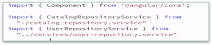
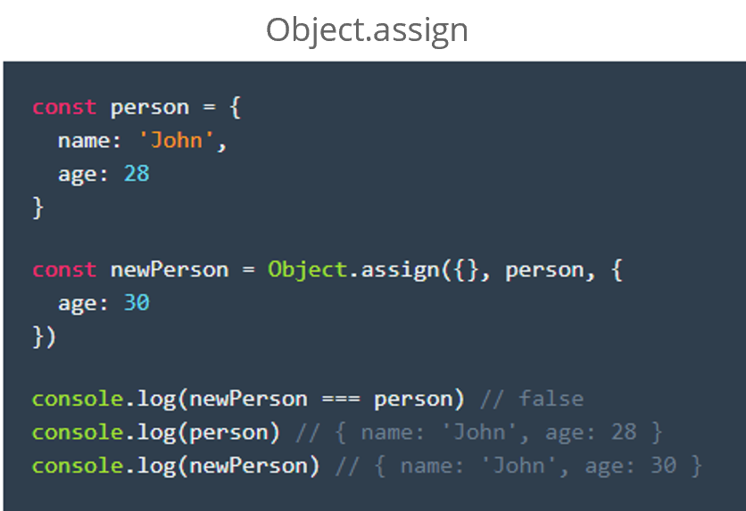
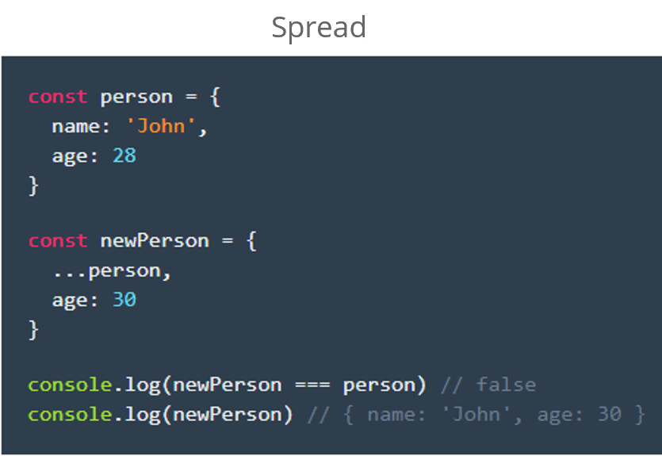
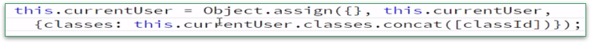

# Angular Best Practices

## Project and folder organization
## Basic coding best practices
## Component and services best practice
## Important performance best practices
## Angular module organization

## Required Prerequisites

##### Basic TypeScript
https://app.pluralsight.com/library/courses/typescript/

##### Basic HTML
https://app.pluralsight.com/paths/skills/html

#####  Fundamental Angular
https://app.pluralsight.com/library/courses/angular
fundamentals/

## Project and Folder Organization

- File Naming
- Folder Structure
- One Item per File

## File and Folder Structure

# LIFT

**L**ocate code quickly

**I**dentify code at a glance

**F**lattest structure possible

**T**ry to be DRY

# File Naming : Component

*  File name should be in lowercase
*  Name should match with the name used in routing
*  Multipart name should be separated by ‘
*  Style file as well as the HTML file should also be given the same name

##### Example:

- Component Name  : item supervision.component.ts
- Style File Name (for css)  : item supervision.component.css
- HTML File Name  : item supervision.component.html

##### Best Practice:
* Always use Angular CLI to create a component
* ng g c initialization/item supervision
* g - short form of ‘generate’
* c - short form of component

# File Naming : Module, Service, Directive, pipe & Others

- File name should be in lowercase
- Multipart name should be separated by ‘
- Name should be followed by the item (.service / .directive / .pipe)

##### Example:

Module : initialization.module.ts
Service : initialization.service.ts
Directive : access check.directive.ts
pipe : uom conversion.pipe.ts

##### Best Practice:
- Always use Angular CLI to create...
- ng g m initialization
- ng g s initialization/initialization
- ng g d access check
- ng g p uom conversion

# Folder Structure : Considerations

- Easy to Find
- Scalability
- Multiple Team / People

##### Example:
- Component : Should have it’s own folder and contains all 4 files related to the component.(Refer
- Feature : Feature module should have its own folder and contains the component, service and route

##### Exception  : Component Folder - 
- If there are not many components in a feature module then each component need not to have it’s own folder.
- Flattest Structure Possible
- Maximum 7 files per Folder

# One Item Per File

- Easy to Locate the file
- Multiple Team / People

##### Example: 
- Component, Service, pipe, directive... : All Should have it’s own file. Should not be written inside another component’s / service’s …

# General Coding Best Practice

## Single Responsibility Principle
## Symbol naming
## Preferring immutability
## Using Small Functions
## Reactive Form Validators

# Single Responsibility

- “A Single class or a Module should only have a single responsibility.” (wiki)
- Other having ‘One Item Per File’, this also has to be considered when adding items in a file 

###### Example:
## Say we have a data service which is used to fetch all the requested data from web API,
- This has to be broken down to individual services.
- Each service must have it’s own file. (One Item per file)

# Symbol naming

- File name and the class name should be the same. 
    E.g: File Name loading-spinner.component.ts : Class Name LoadingSpinnerComponent
- Class name should be in ‘Pascal Case’ and should be suffixed with... 
  - Component - E.g.: ItemSupervisionComponent
  - Service - E.g.: InitializationService
  - Directive - E.g.: AccessCheckDirective
  - Pipe - E.g.: UomConversionPipe
- Constant ,as per style guide, should follow the Camel Case. E.g. courseCatalog but in AL as per Convention 
COURSE_CATALOG
- Public property should be in Pascal Case (against the style guide). E.g.: Course
- Private variable and the method name should be in Camel Case. E.g.: course, getCource(number id) : 

Course Imports:
- First third party imports. 
- Next Application defined imports followed by a line feed 

# Preferring immutability
- This is a good practice in Javascript. (Not specific to Angular…)
- This is recommended by Angular.
- Basically refers to : not mutating existing Javascript object in memory rather creating new objects.
- Helps to avoid certain bugs such as, a value is unexpectedly changed from somewhere else in the code
- Helps in change detection

---

- Object.assign : https://googlechrome.github.io/samples/object-assign-es6/

- The state of Immutability : https://medium.com/dailyjs/the-state-of-immutability-169d2cd11310

- On performance: https://stackoverflow.com/questions/34385243/why-is-immutability-so-important-or-needed-in-javascript

- What is immutability :https://www.sitepoint.com/immutability-javascript/

- --