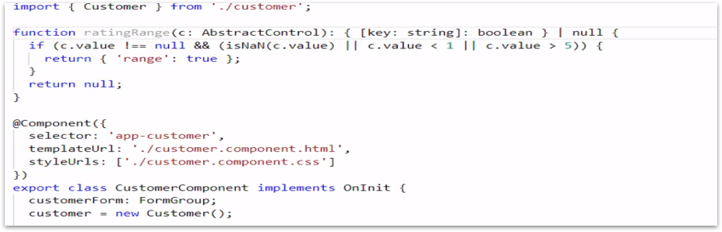
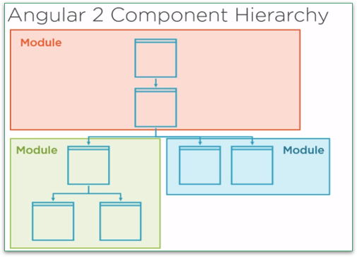
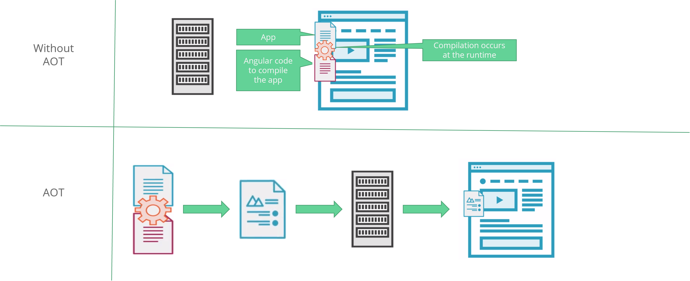

# Angular Best Practices

## Project and folder organization
## Basic coding best practices
## Component and services best practice
## Important performance best practices
## Angular module organization

## Required Prerequisites

##### Basic TypeScript
https://app.pluralsight.com/library/courses/typescript/

##### Basic HTML
https://app.pluralsight.com/paths/skills/html

#####  Fundamental Angular
https://app.pluralsight.com/library/courses/angular
fundamentals/

## Project and Folder Organization

- File Naming
- Folder Structure
- One Item per File

## File and Folder Structure

# LIFT

**L**ocate code quickly

**I**dentify code at a glance

**F**lattest structure possible

**T**ry to be DRY

# File Naming : Component

*  File name should be in lowercase
*  Name should match with the name used in routing
*  Multipart name should be separated by ‘
*  Style file as well as the HTML file should also be given the same name

##### Example:

- Component Name  : item supervision.component.ts
- Style File Name (for css)  : item supervision.component.css
- HTML File Name  : item supervision.component.html

##### Best Practice:
* Always use Angular CLI to create a component
* ng g c initialization/item supervision
* g - short form of ‘generate’
* c - short form of component

# File Naming : Module, Service, Directive, pipe & Others

- File name should be in lowercase
- Multipart name should be separated by ‘
- Name should be followed by the item (.service / .directive / .pipe)

##### Example:

Module : initialization.module.ts
Service : initialization.service.ts
Directive : access check.directive.ts
pipe : uom conversion.pipe.ts

##### Best Practice:
- Always use Angular CLI to create...
- ng g m initialization
- ng g s initialization/initialization
- ng g d access check
- ng g p uom conversion

# Folder Structure : Considerations

- Easy to Find
- Scalability
- Multiple Team / People

##### Example:
- Component : Should have it’s own folder and contains all 4 files related to the component.(Refer
- Feature : Feature module should have its own folder and contains the component, service and route

##### Exception  : Component Folder - 
- If there are not many components in a feature module then each component need not to have it’s own folder.
- Flattest Structure Possible
- Maximum 7 files per Folder

# One Item Per File

- Easy to Locate the file
- Multiple Team / People

##### Example: 
- Component, Service, pipe, directive... : All Should have it’s own file. Should not be written inside another component’s / service’s …

# General Coding Best Practice

## Single Responsibility Principle
## Symbol naming
## Preferring immutability
## Using Small Functions
## Reactive Form Validators

# Single Responsibility

- “A Single class or a Module should only have a single responsibility.” (wiki)
- Other having ‘One Item Per File’, this also has to be considered when adding items in a file 

###### Example:
## Say we have a data service which is used to fetch all the requested data from web API,
- This has to be broken down to individual services.
- Each service must have it’s own file. (One Item per file)

# Symbol naming

- File name and the class name should be the same. 
    E.g: File Name loading-spinner.component.ts : Class Name LoadingSpinnerComponent
- Class name should be in ‘Pascal Case’ and should be suffixed with... 
  - Component - E.g.: ItemSupervisionComponent
  - Service - E.g.: InitializationService
  - Directive - E.g.: AccessCheckDirective
  - Pipe - E.g.: UomConversionPipe
- Constant ,as per style guide, should follow the Camel Case. E.g. courseCatalog but in AL as per Convention 
COURSE_CATALOG
- Public property should be in Pascal Case (against the style guide). E.g.: Course
- Private variable and the method name should be in Camel Case. E.g.: course, getCource(number id) : 

Course Imports:
- First third party imports. 
- Next Application defined imports followed by a line feed 

# Preferring immutability
- This is a good practice in Javascript. (Not specific to Angular…)
- This is recommended by Angular.
- Basically refers to : not mutating existing Javascript object in memory rather creating new objects.
- Helps to avoid certain bugs such as, a value is unexpectedly changed from somewhere else in the code
- Helps in change detection

---

- Object.assign : https://googlechrome.github.io/samples/object-assign-es6/

- The state of Immutability : https://medium.com/dailyjs/the-state-of-immutability-169d2cd11310

- On performance: https://stackoverflow.com/questions/34385243/why-is-immutability-so-important-or-needed-in-javascript

- What is immutability :https://www.sitepoint.com/immutability-javascript/

- --
# Using Small Functions
- Big functions are hard to read because of the complexity
- If a function is more than 5 to 10 lines, think whether you could break it down.

# Reactive Form Validators Custom Validator 1 of 3
- If a validator is global then it has to be defined in the shared module under validators folder and in a class named CustomValidator

# Reactive Form Validators - Custom Validator - 2 of 3

- If a validation is only applicable for a specific form then it has to be declared inside that component itself.
- If a validator is applicable for a feature module then that has to be declared under validators folder of that feature.

# Reactive Form ValidatorsCustom Validator 3 of 3
- If parameters to be passed then use a factory function which returns a validator function

# Angular Module Organization

- Angular modules overview
- Creating a core module
- Creating a shared module
- Creating feature modules

# Angular Module Overview

# Recommended Modules

# Creating Core Module
- ‘BrowserModule’ should only be imported in the AppModule
- ‘CommonModule’ is expected by all the module but import is only allowed in ‘CoreModule’ and ‘SharedModule’

# Creating Shared Module
- All the shared components, directives, pipes should be defined in this module
- ‘CommonModule’ should be exported in this module for other modules to use

# Creating Feature Module
- All the feature specific components, directives, pipes should be defined in this module
- ‘SharedModule’ should be imported in this module
- Components need not to be exported

# Angular Component Best Practices
- Prefixing Component selectors
- Using separate CSS and template files
- Decorating input and output properties
- Component member sequence
- Delegate complex logic to services
- Implementing lifecycle hook interfaces
- When to create components

# Prefixing Component Selectors

- First of all, a selector has to be defined only in case of the component is to be used as child
- Normally 2 to 4 characters, As per TS lint guide line a selector should contains only 3 characters
- Naming conventions:
  - Inside core module : cor
  - Inside Shared module: sha
  - Inside feature module: ini --/ tst --/ prd
  

# Separating Component, CSS and Template
- As per the Angular style guide, if the CSS or Template contains more than 3 lines it has to be put in it’s own file
- Followings are still valid, as it does not violate the LIFT

# Decorating input and output properties

- There are two ways to declare them
	- As metadata
	- Using ‘Input’ and ‘output’ decorator
- As per style guide the best practice is to use the ‘input’ and ‘output’ decorators as there is only one place to change and
easy to locate

# Delegate complex logic to services
- Also related to Single Responsibility principle
# Component member sequence

- Properties at the top of the component
- Members are by default public so no need to mention the keyword public (benefits in package size),
private members should be declared with the keyword ‘private’
- Public members have to be declared first then the the private members
- Constructor should follow next
- Life cycle hooks should follow next
- Methods are by default public so no need to mention the keyword public (benefits in package size),
private methods should be declared with the keyword ‘private’
- Public methods have to be declared first then the the private members
- Caution: If the methods which are called inside a template those must be defined as public. 
**IF NOT THIS WILL WORK IN DEV BUT WILL BREAK IN PRODUCTION MODE.**

# Implementing Lifecycle hook interfaces
- Method called even without implementing the interface, as per BP always implement the interface

# When to (and not to) create component
- Even if the component is smaller, it it can be reused then separate the code block into a new component
- Mostly when it comes to controls, especially ‘input’ don’t try to create own component as it lead to function hiding.

# Angular Services Best Practices

- Marking services as injectable
- Working with Angular injectors
# Marking service as injectable
- Injectable decorator is needed only if the service injects another service
- Recommended practice is to add the decorator
even it the service doesn’t inject any other service
Not Recommended
- Data retrieval (using API…) must be separated from the component and should be inside a separate service

# Working with Angular injectable

- If a service is provided in an eagerly loaded module that will be moved to root by Angular
- If a service is provided in lazy loaded module even if the service is already provided in the root angular will create an
instance of the service again. No Singleton
- If a service is to used inapplication wise the provide that in the core module, if a service is only related to
a feature then provide in the feature module.
- Even though an eagerly loaded module register the service in the root, create that service in that module
not in the ‘CoreModule’

# Angular Performance Best Practices

- Ahead of time compilation and CLI
- Lazy loading feature module
- Paying attention to bundle sizes
- Immutability and onPush change detection
- Pure and impure pipes

# Ahead of time compilation and CLI

# Ahead of time compilation Best Practice

- Use Angular CLI
- Compile before deploying

# Lazy Loading Feature Module

- Another easy performance gain
- Unless user click on a feature, no need to download all the modules of the app at once
- Some users may not even have access to some feature modules

# Monitoring Bundle Size

- Every new release we may need to pay attention to the bundle size, especially the third party bundle

- Use source map tool or any other tool to check
	- npm install -g source map explorer
	- ng build prod source map
	- cd dist (move to dist folder)
	- source map explorer vendor.010c58c8294ceff46d06.dundle.js
- May need to consider this check during the CI (Continuous integration)

# Monitoring Bundle Size: Con..

# Immutability and onPush change detection

- Recommendation is not to always use the onPush change detection, enable only in case if any
considerable performance issue noticed on a component

- Angular’s change detection fires during, all the low level browser events and
results in reevaluating the properties of the object(s)
- With the change detection enabled, the angular will only do the comparison with
object or an array references
- Fires only when an input reference is changed or an async observable fires an
event or few other cases.
-  Fires only when an input reference is changed or an async observable fires an
event or few other cases.

# Pure and Impure Pipe Performance
- Pipes are pure by default

- Making a pipe as impure increases a performance issues

- Use immutability

